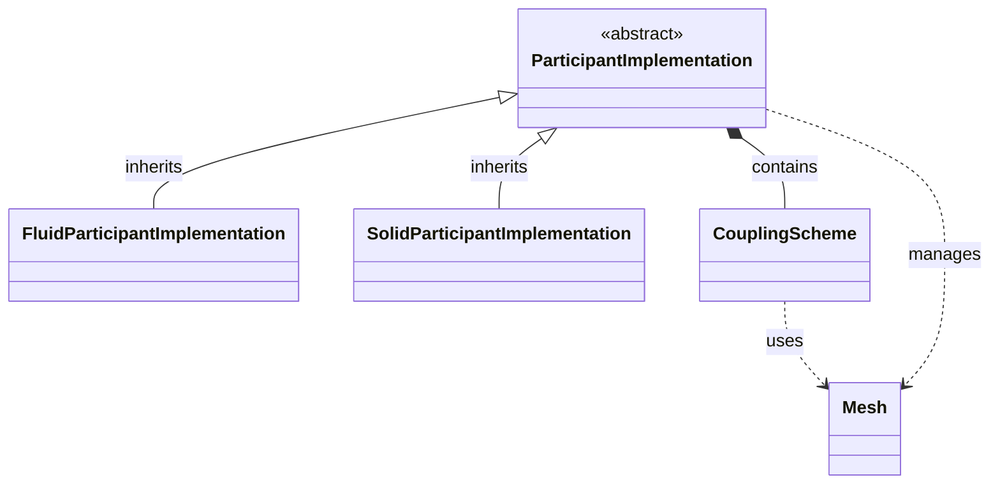
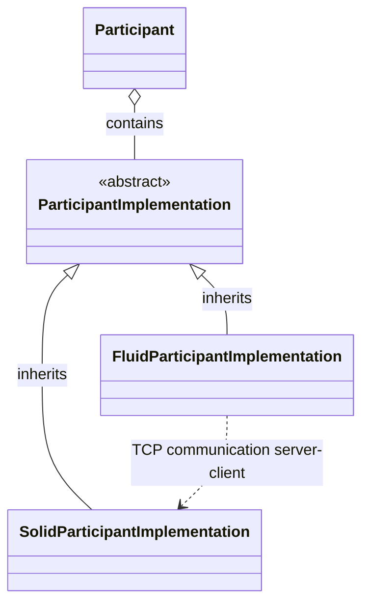
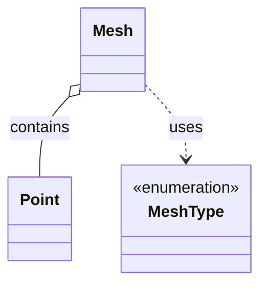

## Component Interaction Diagram

## Communication Diagram

## Data Model Diagram

## Implementation Checklist (12 / 37)

### Constructors & Destructor
- [x] `Participant(participantName, configurationFileName, solverProcessIndex, solverProcessSize)`
- [ ] `Participant(participantName, configurationFileName, solverProcessIndex, solverProcessSize, communicator)`
- [x] `~Participant()`

### Status Queries
- [x] `getMeshDimensions(meshName)`
- [ ] `getDataDimensions(meshName, dataName)`
- [x] `isCouplingOngoing()`
- [x] `isTimeWindowComplete()`
- [x] `getMaxTimeStepSize()`

### Mesh Access
- [ ] `requiresMeshConnectivityFor(meshName)`
- [ ] `resetMesh(meshName)`
- [ ] `setMeshVertex(meshName, position)`
- [ ] `getMeshVertexSize(meshName)`
- [x] `setMeshVertices(meshName, coordinates, ids)`
- [ ] `setMeshEdge(meshName, first, second)`
- [ ] `setMeshEdges(meshName, ids)`
- [ ] `setMeshTriangle(meshName, first, second, third)`
- [ ] `setMeshTriangles(meshName, ids)`
- [ ] `setMeshQuad(meshName, first, second, third, fourth)`
- [ ] `setMeshQuads(meshName, ids)`
- [ ] `setMeshTetrahedron(meshName, first, second, third, fourth)`
- [ ] `setMeshTetrahedra(meshName, ids)`

### Data Access Methods
- [ ] `requiresInitialData()`
- [ ] `requiresGradientDataFor(meshName, dataName)`
- [x] `readData(meshName, dataName, ids, relativeReadTime, values)`
- [x] `writeData(meshName, dataName, ids, values)`
- [ ] `writeGradientData(meshName, dataName, ids, gradients)`
- [ ] `mapAndReadData(fromMeshName, dataName, positions, relativeReadTime, values)`
- [ ] `writeAndMapData(meshName, dataName, positions, values)`

### Direct Access
- [ ] `setMeshAccessRegion(meshName, boundingBox)`
- [ ] `getMeshVertexIDsAndCoordinates(meshName, ids, coordinates)`

### Steering Methods
- [x] `initialize()`
- [x] `advance(computedTimeStepSize)`
- [x] `finalize()`
- [ ] `requiresWritingCheckpoint()`
- [ ] `requiresReadingCheckpoint()`

### Profiling
- [ ] `startProfilingSection(name)`
- [ ] `stopLastProfilingSection()`