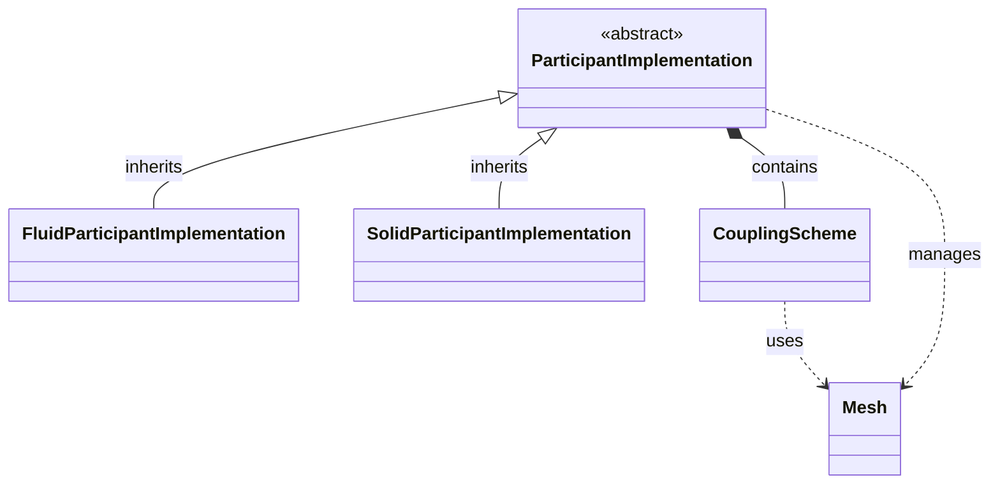
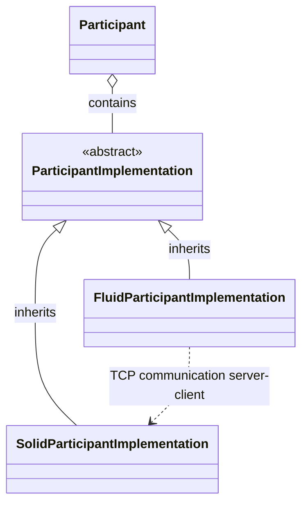
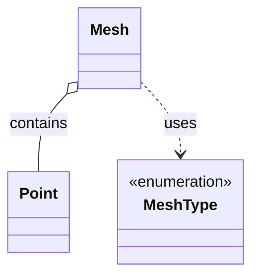

## Component Interaction Diagram

```mermaid
classDiagram
    class ParticipantImplementation {
        <<abstract>>
    }

    class FluidParticipantImplementation

    class SolidParticipantImplementation

    class CouplingScheme

    class Mesh

    ParticipantImplementation <|-- FluidParticipantImplementation : inherits
    ParticipantImplementation <|-- SolidParticipantImplementation : inherits
    ParticipantImplementation *-- CouplingScheme : contains
    CouplingScheme ..> Mesh : uses
    ParticipantImplementation ..> Mesh : manages
```

## Communication Diagram

```mermaid
classDiagram
    class Participant

    class ParticipantImplementation {
        <<abstract>>
    }

    class FluidParticipantImplementation

    class SolidParticipantImplementation


	 Participant o-- ParticipantImplementation : contains
    ParticipantImplementation <|-- FluidParticipantImplementation : inherits
    ParticipantImplementation <|-- SolidParticipantImplementation : inherits
    FluidParticipantImplementation ..> SolidParticipantImplementation : TCP communication server-client
```

## Data Model Diagram

```mermaid
classDiagram
    class Mesh

    class Point

    class MeshType {
        <<enumeration>>
    }

    Mesh o-- Point : contains
    Mesh ..> MeshType : uses
```
